# Sauce Demo Automation Testing Framework
## Introduction

This repository contains a testing framework for a demo automation testing website, using the Page-Object Model (POM). The benefits of the POM model is that it separates each of the aspects of the webpage, making the testing framework more maintainable, while making the code more readable and allowing for code reusability. The testing framework takes advantage of Selenium features, and is compatible with both Chrome and Firefox (Gecko) Selenium Web Drivers.

 _credit: Geeks For Geeks_

This testing framework aims to cover all pages of the Sauce Demo website, and can be used to find possible defects, and to test if certain essential features work as expected. The first section of this documentation will explain this testing framework in detail, and then the second section will show the application's webpages, outlining a standard user journey.

## Section 1 - The Framework

The framework contains the following items:

- Classes for each page, with Get-Only lambda methods that link to each element in the webpage, and public methods that allows for the tester to test certain aspects of the page.
- A general superclass for the website, called SD_Website.cs. This superclass contains a reference to each page class used by the framework, and also constructs an instance of a website with the relevant Selenium Driver.
- Unit tests for each of the page, using standard NUnit test classes. Each test class will run Selenium unit tests, dependent on the page being covered by the test class. They will then close the website using a OneTimeTearDown.
- A SeleniumDriverConfig class - designed to configure the web driver required by the tester who is using the framework.
- BDD Testing files, which include Gherkin styled scripts for each webpage, and the corresponding StepDefinition classes that will contain C# code relating to each of the Gherkin script lines.
- An AppConfigReader file, to read the private TestHost.config.dll file.

The framework does NOT include the TestHost.config.dll file, for security purposes, as this DLL file is often used for storing not only the web links needed to access the relevant pages, but also usernames and passwords. It is a security risk to have these details on a GitHub repository, and usernames being embedded (hardcoded) makes it easier for hackers - especially when working with something more security dependent than a mock site. The AppConfigReader file is designed to bridge the gap between the private DLL file and the framework:

```c#
using System;
using System.Collections.Generic;
using System.Configuration;
using System.Linq;
using System.Text;
using System.Threading.Tasks;

namespace SD_TestAutomationFramework
{
    public class AppConfigReader
    {
        public static readonly string BaseUrl = ConfigurationManager.AppSettings["base_url"];
        public static readonly string User = ConfigurationManager.AppSettings["user"];
        public static readonly string Password = ConfigurationManager.AppSettings["password"];
        public static readonly string LockedOut = ConfigurationManager.AppSettings["locked_out"];
        public static readonly string Problem = ConfigurationManager.AppSettings["problem"];
        public static readonly string PerformanceGlitch = ConfigurationManager.AppSettings["performance_glitch"];
        public static readonly string InvalidUser = ConfigurationManager.AppSettings["invalid_user"];
        public static readonly string InvalidPswd = ConfigurationManager.AppSettings["invalid_password"];
    }
}
```

This makes things much more secure (in most cases, since Sauce Demo will have the user credentials stored in their main page anyways), while still allowing the test framework to use these credentials in test cases. Shown below is an example line in XML for a username & password

```xml
<add key="user" value="username"/>
<add key="password" value="password123"/>
```

The AppConfigReader will then examine the XML file, and search for relevant tags, and assign them the readonly strings. This also keeps things in one place, and aids the single responsibility principle.

### Website Superclass & Page Classes.

#### SD_Website.cs

```c#

    public class SD_Website<T> where T : IWebDriver, new()
    {
        // Acessible Page objects and Selenium driver
        public IWebDriver SeleniumDriver { get; set; }

        public SD_SigninPage SD_SignInPage { get; set; }
        public SD_BasketPage SD_BasketPage { get; set; }
        public SD_ProductsPage SD_ProductsPage { get; set; }
        public SD_CheckoutPage SD_CheckoutPage { get; set; }
        public SD_OverviewPage SD_OverviewPage { get; set; }
        public SD_CheckoutComplete SD_CheckoutComplete { get; set; }
        public SD_Website(int pageLoadInsecs = 20, int implicitWaitInSecs = 20, bool isHeadless = false)
        {
            //instatiate the driver
            SeleniumDriver = new SeleniumDriverConfig<T>(pageLoadInsecs, implicitWaitInSecs, isHeadless).Driver;
            //instatiate our page objects with the selenium driver
            SD_ProductsPage = new SD_ProductsPage(SeleniumDriver);
            SD_SignInPage = new SD_SigninPage(SeleniumDriver);
            SD_BasketPage = new SD_BasketPage(SeleniumDriver);
            //instantiate checkout page object with selenium driver
            SD_CheckoutPage = new SD_CheckoutPage(SeleniumDriver);
            //instantiate overview page object with selenium driver
            SD_OverviewPage = new SD_OverviewPage(SeleniumDriver);
            //instantiate checkout-complete page object with selenium driver
            SD_CheckoutComplete = new SD_CheckoutComplete(SeleniumDriver);
        }
    }
```

This is the webpage superclass. Please note, that for simplicity purposes, *this README will only show the Superclass and one regular Selenium Driver page class*. The set up of this superclass is simple, having public properties representing the application. The main purpose of this is to call the SeleniumDriverConfig code, before setting up certain aspects of the framework's Selenium Driver.

####  SD_ProductsPage.cs

For this documentation, we will use the most fleshed out page, the Product page, which is the page seen directly after the sign in page. The SD_ProductsPage.cs class follows the following structure:

```c#
using OpenQA.Selenium;
using OpenQA.Selenium.Support.UI;

namespace SD_TestAutomationFramework.lib.pages
{
    public class SD_ProductsPage
    {
        //product page related code goes in here (see below) omitted to prevent
        //repetition. it follows this structure:
        //properties
        //constructor
        //methods
    }
}
```

Firstly, the code will begin with using statements, relating to what the product page will use. Note the using statements for the selenium driver.

##### Fields:

```c#
private IWebDriver _seleniumDriver;
private IWebElement _backpackLink => _seleniumDriver.FindElement(By.ClassName("inventory_item_name"));
private IWebElement _filterLink => _seleniumDriver.FindElement(By.ClassName("product_sort_container"));
private IWebElement _filterZA => _filterLink.FindElement(By.XPath("//option[text() = 'Name (Z to A)']"));
private IWebElement _firstItem => _seleniumDriver.FindElement(By.ClassName("inventory_list")).FindElement(By.XPath($"//div[1]")).FindElement(By.ClassName("inventory_item_name"));
...
```

These private fields (with the exception of the _seleniumDriver property) will each use a special lambda method, allowing for the use of GET only. These fields all link to a specific aspect of the webpage, found either by a path, ID, or ClassName - of which either of these three can be found by using developer tools in a modern web browser such as Firefox or a Chromium browser. This aids the tester, by allowing certain aspects of the web application to be used within this class, and within test cases via the public methods in the class. 

##### Constructor

```c#
public SD_SigninPage(IWebDriver seleniumDriver) => _seleniumDriver = seleniumDriver;
```

The constructor makes use of the Lambda style method, which keeps things on a single line, rather than requiring curly braces. This takes one parameter, of type IWebDriver, which is stored as the page's Selenium Driver.

##### Methods

```c#
...
public void ClickFilterType(string filterType) => _seleniumDriver.FindElement(By.XPath($"//option[text() = '{filterType}']")).Click();
public string FirstItemName() => _firstItem.Text;

public void AddToBasket(string item)
{
	IWebElement itemToAdd = _seleniumDriver.FindElement(By.Id($"add-to-cart-sauce-labs-{item}"));
	itemToAdd.Click();
}

public void RemoveFromBasket(string item)
{
	IWebElement itemToRemove = _seleniumDriver.FindElement(By.Id($"remove-sauce-labs-{item}"));
	itemToRemove.Click();
}
public IWebElement GetShoppingCart => _shoppingCart;
public IReadOnlyList<IWebElement> CartItems => _items;
...
```

These methods are all public, and represent certain actions that the webpage would usually carry out. This allows for the tester to call certain features present in the application, to aid testing. For example, with this page class, the tester has a simple way of creating a test case where a user adds items to basket and then perhaps decides to delete one item - before going to checkout.

Most methods use the lambda notation, where possible - however, some methods had to be coded traditionally, due to the need to write multiple lines.

### Unit Tests

```c#
[Test]
public void GivenIAmOnTheProductsPage_WhenIClickTheRemoveButton_TheItemShouldBeRemovedFromCart()
{
	string product = "fleece-jacket";

	SD_Website.SD_SignInPage.VisitSignInPage();
	SD_Website.SD_SignInPage.InputUserName(user);
	SD_Website.SD_SignInPage.InputPassword(passwd);
	SD_Website.SD_SignInPage.clickSignIn();

	SD_Website.SD_ProductsPage.AddToBasket(product);

	IReadOnlyList<IWebElement> cartItemsB4 = SD_Website.SD_ProductsPage.CartItems;
	int countB4 = cartItemsB4.Count;

	SD_Website.SD_ProductsPage.RemoveFromBasket(product);

	IReadOnlyList<IWebElement> cartItemsAfter = SD_Website.SD_ProductsPage.CartItems;
	int countAfter = cartItemsAfter.Count;

	Assert.That(countB4 > countAfter, Is.True);
}
```

This is an example of a unit test for the Products page. As you can see, the user has to be signed in first, before anything can be done to the products page. The unit test code will call relevant functions to the page, allowing the tester to check for a defect. If the NUnit test fails, then there is a defect in the code.

### BDD TESTING

### SpecFlow Feature Example

SpecFlow is a way to simplify the test writing process, with C#, by using human readable Gherkin scripts to help create StepDefinition methods. This method was the one mainly used for doing tests on the webpage. Shown below will be an example of the product tests in Gherkin format:

```
Feature: Products

As a user, I want to to be able to find the products I am interested in, by filtering and viewing items

@HappyPath
Scenario: Remove Item From Cart
	Given I am signed in and on the products page
	When I add an "<item>" to the cart
	And I remove the "<item>" from the cart
	Then the number of items in cart is 0
	Examples: 
	| item          |
	| fleece-jacket |
	| bike-light    |

@HappyPath
Scenario: Go To Basket
	Given I am signed in and on the products page
	When I press the basket button
	Then I am taken to the basket page
```

When writing new Gherkin scripts to test the functionality, the tester will need to find the Define Steps in the context menu - right clicking on purple text when using Visual Studio. This allows the tester to convert the Gherkin scripts into C# code - in which the tester can either create a brand new class for the Step Definitions, or copy into the clipboard if the Step Definition class already exists.

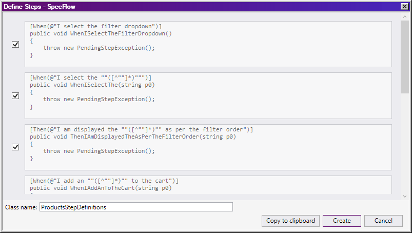

### SpecFlow Step Example

```c#

    [Binding]
    [Scope(Feature = "Products")]
    public class ProductsStepDefinitions : SharedSignIn_StepDefinition
    {

        [When(@"I select the (.*) I want to inspect")]
        public void WhenISelectTheIWantToInspect(int item)
        {
            SD_Website.SD_ProductsPage.SelectItem(item);
            Thread.Sleep(3000);
        }

        [When(@"I select the filter dropdown")]
        public void WhenISelectTheFilterDropdown()
        {
            SD_Website.SD_ProductsPage.ClickFilterLink();
            Thread.Sleep(3000);
        }

        [When(@"I select the ""([^""]*)""")]
        public void WhenISelectThe(string filtertype)
        {
            SD_Website.SD_ProductsPage.ClickFilterType(filtertype);
            Thread.Sleep(3000);
        }
        ...
    }
```

This is an example of a step definition class - for the products page. The use of SpecFlow allows the tester to split each aspect of the testing process. This aids refactoring, and helps prevent repeated code - although _repeating code can sometimes be more useful when testing_, especially when it comes to readability. Tests are often used as living documentation of the code.

### Running Tests

To run these tests, the tester will need to open up Visual Studio's test explorer, before clicking on either the test all button, or the test button to test specific cases. In both cases, this will start the Selenium Tests. If headless, this will be done in the background, otherwise Chrome or Firefox will open up with a new window. The browser will then be controlled by the explorer - while the test cases run. An example result shows as follows:

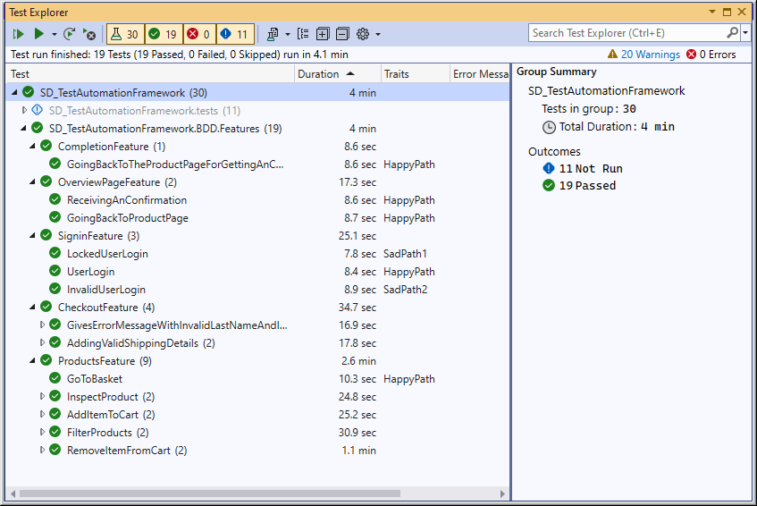

Due to the intuitive nature of Visual Studio, if a test case fails, then the tester can then examine the test explorer to find out where the defect is.

## Section 2 - Application Overview

This automation testing framework is designed around a mock online shopping website called SauceDemo - by the company Sauce Labs (_formerly Swag Labs_). This web application is designed to mimic the typical functions of a shopping application, including the sign in process, the store & basket section, and the checkout section. This application is designed for practicing testing, either by explorative means, or by using an automotive web testing system such as Selenium.

### Sign in Page

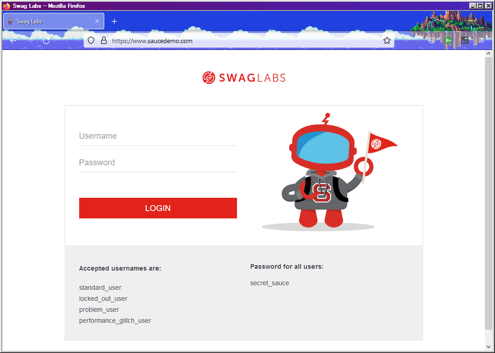

This is the sign in page, designed to mimic similarly designed sign in pages from other online retail stores. This sign in page is simplistic in nature, asking only for a username and password. The application provides certain usernames for testers to use, each using the same password. Any other usernames/passwords will result in an invalid user error:

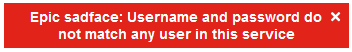

Additionally, if the tester types in the locked out credentials, they will get a different error - shown below:


All other users will work, however, the performance glitched user will have delays while using the service, while the problem user will have a store page similar to the one shown below:

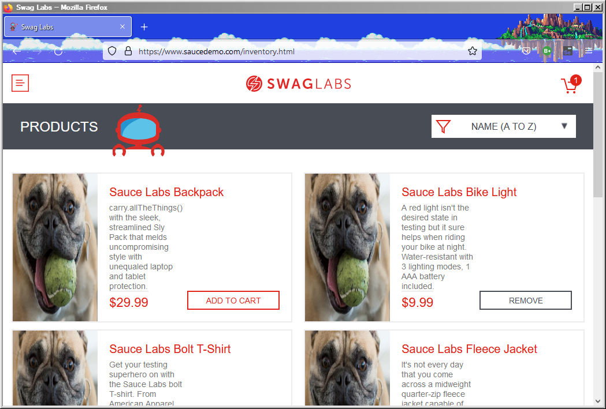

The problem user will experience additional issues, such as the inability to filter items, or remove/add certain items to the basket. The problem user also cannot check out.

### Store Page

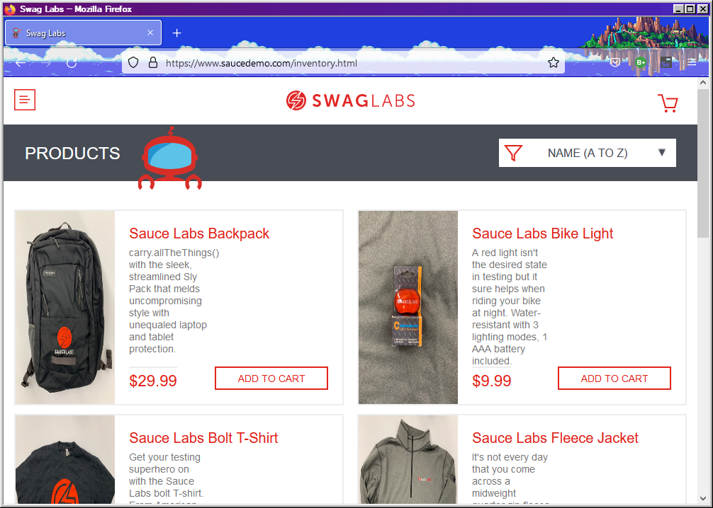

This is the store page, where users may add or remove certain images to the cart, examine certain aspects in detail, filter items based on their price or alphabetical order, or enter the basket page. When the user clicks on a specific item, they will see an item card that looks like this:

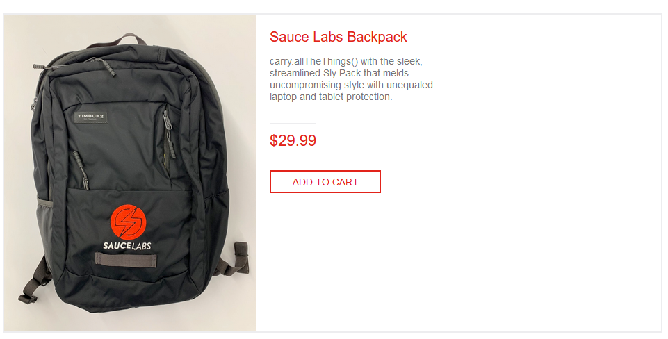

This works in a similar way to the card in general user interface, where the user can opt to add that item to the cart, or return to the main shopping page.

### Basket

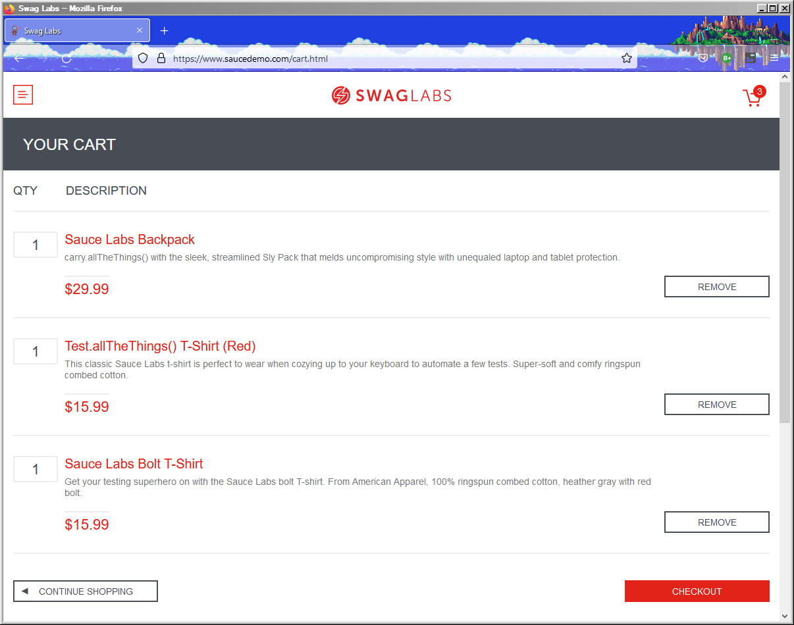

This is the cart page, where the user can examine the items that they have bought, before deciding whether to checkout or return to the main shopping page. Additionally, users can remove items from their shopping list before deciding to enter the checkout page. However, changing the quantity is not possible (as users can only "purchase" one item on this website).

Once the user completes this, they will be sent down to the checkout.

### Checkout

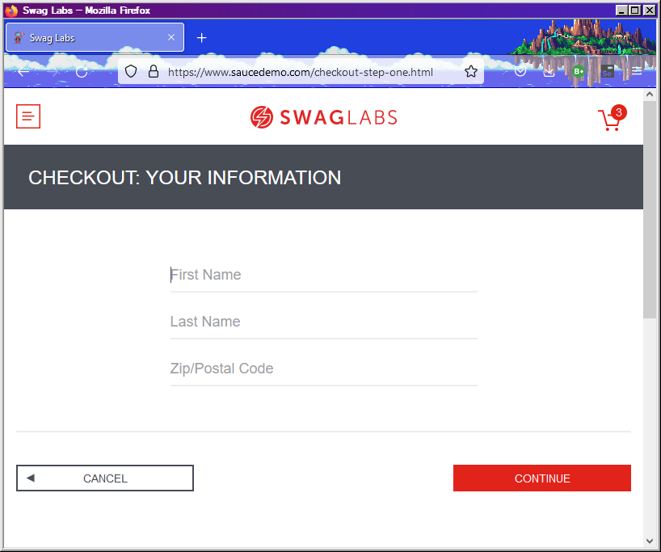

Here, the user can either enter relevant details, or return to the basket page. The form is basic, as it is only designed to simulate a mock store. Here, the user can type in the first name, last name and a ZIP/Post code. Once they have entered these details, they will be taken to one final page:

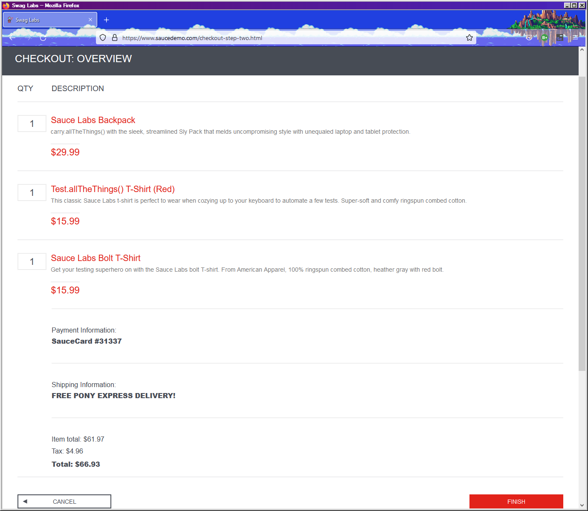

This looks similar to the basket list - only with added sections involving the payment information, the shipping information and the total price after taxes. Please note that the (fake) card information and shipping information has been hardcoded in by Swag Labs.

Once the user is happy with these details, then they can click onto the finish button, which will then take them to the final page, which shows that the purchase is complete.

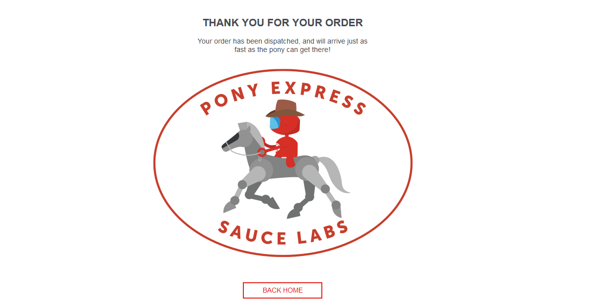

### Additional: Sidebar

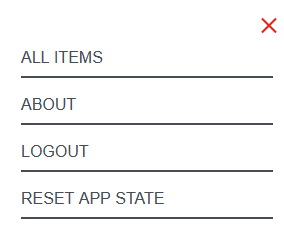

There is also a sidebar, that can be accessed by the majority of pages. This allows either return to the items list, reset the application, log out of the mock account or click on the about section, which will take you to the Sauce Labs website.
