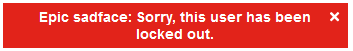

# Sauce Demo Automation Testing Framework
## Introduction

This repository contains a testing framework for a demo automation testing website, using the Page-Object Model (POM). The benefits of the POM model is that it separates each of the aspects of the webpage, making the testing framework more maintainable, while making the code more readable and allowing for code reusability. The testing framework takes advantage of Selenium features, and is compatible with both Chrome and Firefox (Gecko) Selenium Web Drivers.

 _credit: Geeks For Geeks_

This testing framework aims to cover all pages of the Sauce Demo website, and can be used to find possible defects, and to test if certain essential features work as expected. The first section of this documentation will explain this testing framework in detail, and then the second section will show the application's webpages, outlining a standard user journey.

## Section 1 - The Framework

## Section 2 - Application Overview

This automation testing framework is designed around a mock online shopping website called SauceDemo - by the company Sauce Labs (_formerly Swag Labs_). This web application is designed to mimic the typical functions of a shopping application, including the sign in process, the store & basket section, and the checkout section. This application is designed for practicing testing, either by explorative means, or by using an automotive web testing system such as Selenium.

### Sign in Page

This is the sign in page, designed to mimic similarly designed sign in pages from other online retail stores. This sign in page is simplistic in nature, asking only for a username and password. The application provides certain usernames for testers to use, each using the same password. Any other usernames/passwords will result in an invalid user error:

Additionally, if the tester types in the locked out credentials, they will get a different error - shown below:

All other users will work, however, the performance glitched user will have delays while using the service, while the problem user will have a store page similar to the one shown below:

The problem user will experience additional issues, such as the inability to filter items, or remove/add certain items to the basket. The problem user also cannot check out.

### Store Page

This is the store page, where users may add or remove certain images to the cart, examine certain aspects in detail, filter items based on their price or alphabetical order, or enter the basket page. When the user clicks on a specific item, they will see an item card that looks like this:

This works in a similar way to the card in general user interface, where the user can opt to add that item to the cart, or return to the main shopping page.

### Basket

This is the cart page, where the user can examine the items that they have bought, before deciding whether to checkout or return to the main shopping page. Additionally, users can remove items from their shopping list before deciding to enter the checkout page. However, changing the quantity is not possible (as users can only "purchase" one item on this website).

Once the user completes this, they will be sent down to the checkout.

### Checkout

Here, the user can either enter relevant details, or return to the basket page. The form is basic, as it is only designed to simulate a mock store. Here, the user can type in the first name, last name and a ZIP/Post code. Once they have entered these details, they will be taken to one final page:

This looks similar to the basket list - only with added sections involving the payment information, the shipping information and the total price after taxes. Please note that the (fake) card information and shipping information has been hardcoded in by Swag Labs.

Once the user is happy with these details, then they can click onto the finish button, which will then take them to the final page, which shows that the purchase is complete.

### Additional: Sidebar

There is also a sidebar, that can be accessed by the majority of pages. This allows either return to the items list, reset the application, log out of the mock account or click on the about section, which will take you to the Sauce Labs website.
